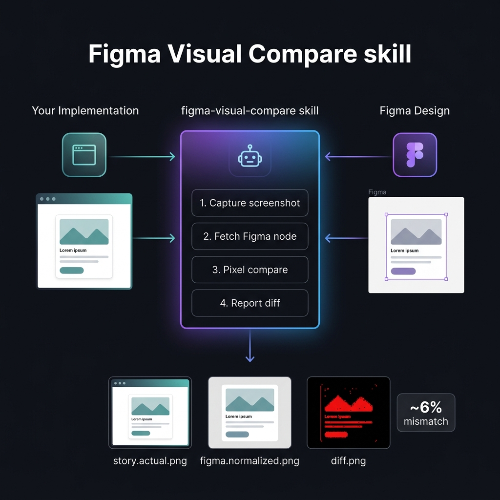
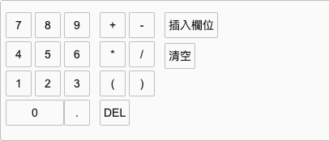
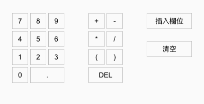
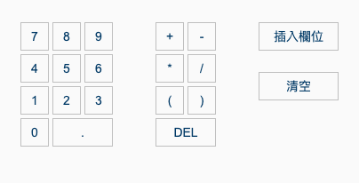
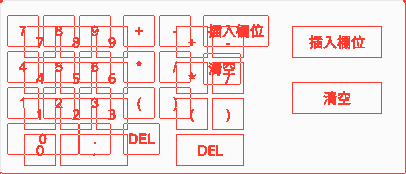
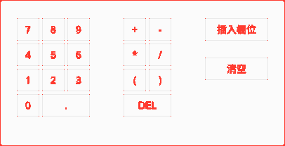
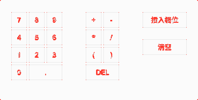
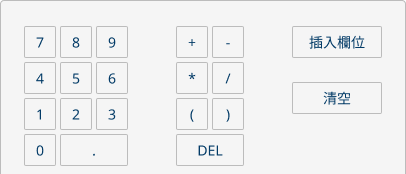

# Figma Visual Compare Skill — 中文說明

> **English README: [README.md](README.md)**

`figma-visual-compare` 是一個可重複使用的 agent skill，讓 AI agent 能自動比對你的 UI 元件實作與 Figma 設計節點之間的視覺差距，輸出像素級的差異報告，並迭代修正直到版面對齊。



---

## 用途

當你請 agent 比對元件與 Figma 設計稿，skill 會：

1. **擷取** 元件在 Storybook 中的截圖
2. **取得** Figma 設計節點（透過 Figma API）
3. **比對** 兩張圖片的像素差異
4. **回報** mismatch ratio、差異覆蓋圖，以及修正建議
5. **迭代** — 套用程式碼修改後重新比對，直到分數有明顯改善

---

## 真實範例

### 迭代進度

Agent 共比對了三次，每次比對後套用修正再重跑：

| | ① 初始 | ② 修正版面後 | ③ 調整 inset 後 |
|---|:---:|:---:|:---:|
| **mismatchRatio** | **11.81%** | **3.52%** | **1.78%** |
| **Storybook** |  |  |  |
| **diff.png** |  |  |  |
| **修改內容** | 基準比對 — 間距、padding、鍵位寬度全部偏差 | 套用 `px-24`、`gap-48`、`gap-24`；修正最後一列鍵位寬度 | 調整 `--actual-inset`；版面已像素對齊 |
| **剩餘差異** | 所有按鍵與按鈕未對齊 | 背景色 + 一個按鈕文字 | 僅一個按鈕文字（字型渲染誤差） |

**Figma 設計稿**（三輪比對的目標）：



---

## 使用方式

### 請 Agent 執行

安裝 skill 後，直接用自然語言告訴 agent：

> *「請幫我比對 `<元件名稱>` 的 Storybook Story 和這個 Figma 節點：`<figma-url>`，告訴我 mismatch ratio 和最大的視覺差異在哪裡。」*

> *「針對 `<story-id>` 這個 Story，用 `<figma-url>` 的 Figma 設計稿跑視覺比對。如果有 layout 問題，幫我修掉再重跑，直到分數有明顯改善。」*

> *「現在的 `<元件名稱>` 實作和 Figma 設計稿有多接近？找出差異區域，告訴我要改哪裡。」*

Agent 會自動處理擷取、比對、報告、迭代修正的全流程。

### Agent 的執行步驟

```
1. 找到目標元件對應的 Storybook Story
2. 決定最適合的 CSS selector 來隔離元件範圍
3. 透過 Playwright + Storybook 擷取截圖
4. 透過 Figma API 取得設計節點圖片
5. 執行像素比對並輸出 diff 成果
6. 分析最大差異區域
7. 套用程式碼修正，重新比對，直到分數顯著改善
```

---

## 產出物

| 檔案 | 說明 |
|------|------|
| `mismatchRatio` | 整體像素差異比率，0 代表完全一致 |
| `diff.png` | 標示差異像素的熱圖 |
| `diff.overlay.png` | 帶編號差異區域的覆蓋圖 |
| `story.actual.png` | 從 Storybook 擷取的截圖 |
| `figma.normalized.png` | Figma 匯出的參考圖（縮放對齊後） |
| `report.json` | 完整 JSON 報告，含各區域差異資料 |

---

## 前置需求

| 需求 | 說明 |
|------|------|
| **Storybook** | 目標元件需有對應的 Storybook Story，作為擷取來源 |
| **Figma MCP** | Agent 需要 Figma MCP 存取權，才能讀取設計節點資訊 |
| **Figma API Token** | 需設定環境變數 `FIGMA_API_TOKEN` 或 `FIGMA_TOKEN` |
| **Node.js** | 執行主要比對腳本 `figma-visual-compare.cjs` |
| **Python 3.10+** | 執行像素比對腳本 `image_diff.py` |
| **@playwright/test** | Storybook 截圖依賴 Playwright |
| **sharp** | 圖片處理依賴，從目標專案自動解析 |

> `@playwright/test` 與 `sharp` 從**目標專案**優先解析，不需要全域安裝。

---

## 安裝

### 使用 `npx skill add`（推薦）

專案內安裝：

```bash
npx skill add https://github.com/gh286991/figma-visual-compare --skill figma-visual-compare
```

全域安裝：

```bash
npx skill add https://github.com/gh286991/figma-visual-compare --skill figma-visual-compare --global
```

列出 repo 中可用的 skill：

```bash
npx skill add https://github.com/gh286991/figma-visual-compare --list
```

### Claude

將 `skills/figma-visual-compare/` 複製到：

```
~/.claude/skills/figma-visual-compare/
```

若 Claude 環境支援 custom skill 上傳，也可將資料夾打包後上傳。

### Cursor

將 adapter 檔案複製到目標專案：

```
skills/figma-visual-compare/adapters/cursor/figma-visual-compare.md
  → .cursor/skills/figma-visual-compare.md
```

### AGENTS 類工具

從 `skills/figma-visual-compare/adapters/` 選用對應檔案，複製到工具支援的 `AGENTS.md` 或等價指令檔。

---

## 相容性

| 工具 | 安裝方式 |
|------|----------|
| Claude | `~/.claude/skills/` 或 `npx skill add` |
| Codex | `~/.codex/skills/` 或 `npx skill add` |
| Cursor | `.cursor/skills/` adapter |
| AGENTS 類工具 | `AGENTS.md` adapter |
